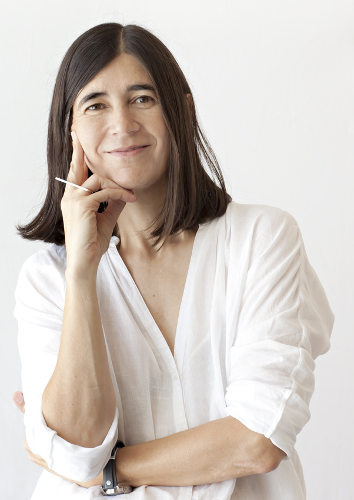

Es una bióloga molecular y científica española especializada en el estudio de los telómeros y la telomerasa.1​Desde el 22 de junio de 2011 dirige en España el Centro Nacional de Investigaciones Oncológicas

